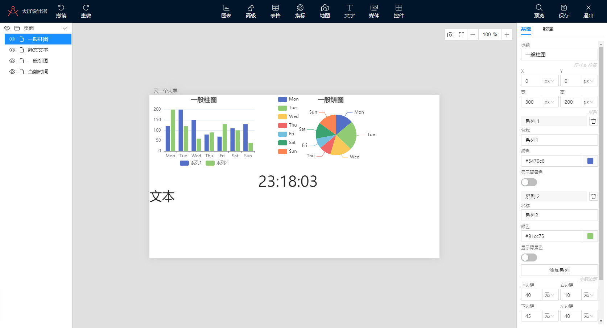

# Screen Editor

一个大屏设计前端组件，主要使用到以下技术：

* React
* Craftjs
* AntDesign
* ECharts
* ArcGIS
* GaoDe

# 启动
准备好 FontAwesome 的 Token，在根目录创建 `.npmrc` 文件。文件内容如下：
```
@fortawesome:registry=https://npm.fontawesome.com/
//npm.fontawesome.com/:_authToken=«YOUR TOKEN»
```
然后运行以下命令：
```
> yarn
> yarn storybook
```
在打开的浏览器中查看 storybook 的各个实例。

# 截图
